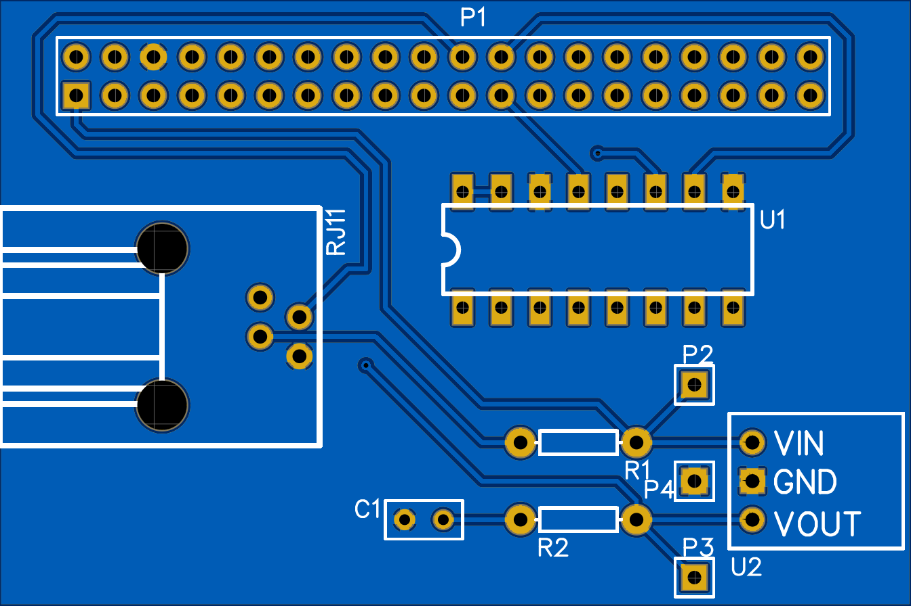

# rsc-2019-weather-station

A Weather Station implementation for the 1st Undergraduate Robotic Sailing Challenge 2019

## Table of contents

* [Components](#components)
* [Requirements](#requirements)
* [Installation](#installation)
* [Running](#running)
* [Usage](#usage)
* [Autostart](#autostart)
* [Data](#data)
* [Demo](#demo)

## Components

### Weather station

[SparkFun Electronics SEN-08942](https://www.digikey.de/product-detail/de/sparkfun-electronics/SEN-08942/1568-1555-ND/5684383)

[Data sheet](https://www.sparkfun.com/datasheets/Sensors/Weather/Weather%20Sensor%20Assembly..pdf)

#### PCB

The Gerber files are in the `pcb` directory



The pcb design is here: https://easyeda.com/D3473R/weather-station

### Wifi Adapter

[Alfa Network AWUS036NHA](https://www.amazon.de/dp/B01D064VMS/ref=cm_sw_r_cp_apa_i_2wD4Bb07P9566)

### Wifi Adapter Bracket

You will need 2 M3 screws with min. 15mm length and two nuts

#### Side 1

[Wifi_Adapter_Bracket_20mm_Side_1.stl](wifi-adapter-bracket/Wifi_Adapter_Bracket_20mm_Side_1.stl)

#### Side 2

[Wifi_Adapter_Bracket_20mm_Side_2.stl](wifi-adapter-bracket/Wifi_Adapter_Bracket_20mm_Side_2.stl)

## Requirements

### Update packages
* `sudo apt update`
* `sudo apt install python3-dev`

### [pipenv](https://github.com/pypa/pipenv)

* Remove pip from apt as it may collide with pip installed from pipenv `sudo apt remove python-pip`
* Install pipenv `curl https://raw.githubusercontent.com/kennethreitz/pipenv/master/get-pipenv.py | sudo python`

### [git](https://git-scm.com/)
* Install git with `sudo apt install git-core`

### [mosquitto](https://mosquitto.org/)

* Install mosquitto with `sudo apt-get install -y mosquitto`

## Installation

* Clone the repository with `git clone https://github.com/D3473R/rsc-2019-weather-station.git`
* Navigate in the cloned directory with `cd rsc-2019-weather-station`
* Install the python dependencies with `pipenv install`

## Running

* Start a pipenv shell with `pipenv shell`
* Run `weather.py` with `python src/weather.py`

To receive the data on another machine you can use any MQTT Client, e.g. [mqttfx](https://mqttfx.jensd.de/).

Simply connect to the ip of the raspberry and subscribe to the channel `weather`

To receive the data in python you can also use [paho-mqtt](https://pypi.org/project/paho-mqtt/)

## Usage

```sh
usage: weather.py [-h] [--server MQTT_SERVER] [--path MQTT_PATH]
                  [--speed SPEED_PIN] [--dir-error DIRECTION_ERROR]
                  [--dir-prec DIRECTION_PRECISION] [--send-sleep SEND_SLEEP]
                  [--chart]

optional arguments:
  -h, --help            show this help message and exit
  --server MQTT_SERVER, -s MQTT_SERVER
                        the ip of the mqtt server (default: localhost)
  --path MQTT_PATH, -p MQTT_PATH
                        the path of mqtt packets (default: weather)
  --speed SPEED_PIN     the gpio pin which is connected to the wind speed
                        sensor (default: 25)
  --dir-error DIRECTION_ERROR
                        the direction value that will be written if an invalid
                        direction was read (default: 359)
  --dir-prec DIRECTION_PRECISION
                        the precision in Volts of the mapped direction values
                        (default: 0.015)
  --send-sleep SEND_SLEEP
                        the time in seconds between two mqtt packets (default:
                        0.2)
  --chart, -c           enable asciichartpy (default: False)
```

## Autostart

Autostart of the weather station can be accomplished via systemd.

Create a service file:

`sudo nano /etc/systemd/system/weather-station.service`

And enter the following:

```sh
Unit]
Description=Weather Station Service
After=network.target

[Service]
User=pi
Restart=always
Type=simple
WorkingDirectory=/home/pi/rsc-2019-weather-station/
ExecStart=/usr/local/bin/pipenv run python /home/pi/rsc-2019-weather-station/src/weather.py

[Install]
WantedBy=multi-user.target
```

Reload the systemd daemon with:

`sudo systemctl daemon-reload`

Start the service with:

`sudo systemctl start weather-station`

If you want the weather station to start on boot enter:

`sudo systemctl enable weather-station`

## Data

A JSON packet consists of the timestamp the packet was sent, the wind direction in degrees (in 16 steps) and the wind speed in m/s.

`{"timestamp": "2019-02-13T15:01:13Z", "direction": 67.5, "speed": 4.32}`

## Demo

[](https://asciinema.org/a/227526)
